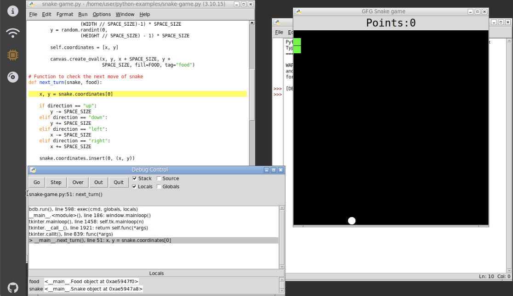

# WebVM personal Linux desktop — LAN-only, self-hosted

[](https://github.com/ned14/webbrowser-python-idle/actions/workflows/ci.yml)

A personal Linux desktop that runs entirely in the browser via
[WebVM/CheerpX](https://webvm.io): a minimal **i386 Alpine** guest with
**stdlib-only Python and IDLE** (`idle3.14`), an Xorg/Openbox desktop, **LAN-only
networking**, and **configurable persistent storage** — browser IndexedDB by
default, or Samba / container WebDAV through a guest sync agent.

**IDEAL** for learning Python in environments with only a locked down web browser e.g.
Google Chromebooks. Packaged as a docker compose for easy installation on your
home server.



Due to the live JIT emulation of i386 in WebAssembly, performance is not blazing
fast, but it's acceptable. If loading the disc image off LAN, it should boot to the
file manager in fifteen to twenty seconds. IDLE takes about three to five
seconds to launch, after that editing Python and running its debugger has
very reasonable performance.

Copy & paste with the host works through the sidebar **Clipboard** panel only
("paste as if typed by keyboard" — the CheerpX runtime implements no
`/dev/clipboard`): text is typed into the focused guest window as if you had
typed it by hand. See [Paste from the device](#paste-from-the-device).

## Try it **LIVE**

The project website **is the VM**: the latest `main` build runs entirely in your
browser at
[**https://ned14.github.io/webbrowser-python-idle/alpine.html**](https://ned14.github.io/webbrowser-python-idle/alpine.html)
— test-drive it there before running it yourself. The first load takes about sixty
seconds to boot; later visits reuse the browser cache, then boot takes less than
twenty seconds. This poor performance is due to Github Pages not honouring HTTP
Range requests, so we split the ext2 image into 128 Kb chunks, and every page
fault turns into a whole individual HTTPS GET round trip.

When running on LAN, the VM is noticeably more snappy, even on a relatively
limited CPU such as a Chromebook or a phone. The Docker image's HTTPS server
uses HTTP/2 and therefore highly concurrent random i/o performs better than on
HTTP/1 where pipelining is constrained.

## FAQ

**Why does upstream https://webvm.io/alpine.html load much faster than this project's GitHub Pages site?**

The two sites stream the disk image completely differently:

- **webvm.io uses CheerpX's `CloudDevice`** over one persistent `wss://`
  connection (`wss://disks.webvm.io/alpine_20251007.ext2`): every block read is
  a byte-range request pipelined over that single socket — one TLS handshake,
  no per-request latency.
- **GitHub Pages cannot do that.** Pages ignores HTTP `Range` headers and
  cannot serve WebSockets, so the Pages workflow pre-splits the ext2 into
  128 KiB `.txt` chunks and CheerpX's `GitHubDevice` fetches each block as a
  *separate* HTTPS request. A desktop boot reads well over a thousand chunks,
  so per-chunk CDN round-trip latency dominates the load time.

**Is their image smaller?** No — it is literally the same file. webvm.io
serves the stock `alpine_20251007.ext2` (1.5 GB, the copy in
`reference_images/`), while this project's guest is far smaller (~163 MB).
Image size barely matters either way: both runtimes fetch only the blocks the
boot actually reads, never the whole file. The difference is pure transport,
not bytes.

**Why is the LAN deployment so much snappier?** Because this project's nginx
honors HTTP `Range` requests (`diskImageType="bytes"`, `HttpBytesDevice`):
each block is fetched over a keep-alive connection to a server on your LAN —
milliseconds per block instead of a CDN round-trip.

**Can the GitHub Pages site be made as fast?** Not on Pages itself. Options:
host the image where HTTP Range (or a `wss://` Range proxy like Leaning's
`disks.webvm.io`) is available, or run it on your LAN — which is this
project's intended deployment anyway.

**How do I paste content from outside into the VM?** Host → guest text goes
through the sidebar's **Clipboard** panel (clipboard
icon). Type or browser-paste (Ctrl+V) text into the box, click **Paste**, and
it is typed into the **focused guest window** (IDLE, xterm, the file
explorer's Search box, …) as if you had typed it by hand — the guest
`paste-typer.sh` drives the XTEST extension via `xsendkeys`
(XTestFakeKeyEvent), the same key events a human produces.

- **Files:** use the **Open file…** link or drag-and-drop a file onto the box —
  its text content is loaded and pasted exactly like typed text.
- **ASCII only:** the paste is literal keystrokes, so only printable ASCII
  (plus Return/Tab/Backspace) can be typed; anything else (é, “smart quotes”,
  日本語, emoji, control chars) is refused with a diagnostic naming the
  offending character — before anything is sent.
- **Speed warning:** typing is character-by-character (~100 chars/s), so the
  panel shows a live estimate ("1,234 chars — ~12s to type") once the content
  is long, and refuses above 10,000 characters.

## Quick start (browser mode — no tailnet)

```sh
make certs          # private CA + server cert (trust certs/ca.crt once in the browser)
make build          # guest ext2 -> webvm/custom-disk-images, frontend, container images
make up             # https://127.0.0.1:8081/alpine.html
```

Open `https://127.0.0.1:8081/alpine.html` (the private CA must be trusted in
the browser — HTTPS is the only access mode; there is no plain-HTTP path). The
desktop boots to the **file explorer** open on `~/` (a keep-alive daemon
relaunches it whenever the last window closes, so the desktop never sits
empty); new files/folders are created from the toolbar, and `.py` files open in
**IDLE** via the *Open in IDLE* button (or double-click / Ctrl+O) — the
explorer disables its UI while IDLE runs and re-enables, listing refreshed,
when IDLE exits. Example scripts are baked read-only into `~/examples/`
(reference material to copy, not edit in place). Files in `~/` survive reloads
via the browser IndexedDB overlay. Use `make url` to print the session URL.

## Storage backends (`STORAGE_BACKEND`)

| Backend | Guest files live in | Extra services |
|---|---|---|
| `browser` (default) | browser IndexedDB overlay (per-origin, versioned to the image build) | none — nginx-only server |
| `none` | nothing (fresh overlay per session) | none |
| `samba` | your existing LAN Samba share (via the gateway relay + guest `pysmb` agent) | headscale + gateway |
| `webdav` | a wsgidav container on a Docker volume (PROPFIND/PUT/GET) | headscale + gateway |

Set it in `.env` (copy `.env.example`), or edit `compose.yaml`'s inline default.
`make build` and `./build.sh` read `STORAGE_BACKEND` from `.env` (a command-line
argument or exported variable overrides it), so the built guest image always
matches the deployment; `make up` / `make up-tailnet` refuse to start when the
built image's backend disagrees with `.env` — rebuild with `make build`.

## Tailnet modes (`samba` / `webdav`)

```sh
# 1. one-time key bootstrap (headscale is started in bootstrap mode, which
#    skips the fail-closed key check)
cat > .env <<EOF
STORAGE_BACKEND=webdav
WEBDAV_USER=webdav
WEBDAV_PASS=<a-real-password>
HEADSCALE_BOOTSTRAP=1
EOF
make build && docker compose up -d server

# 2. create the two reusable, long-lived preauth keys and record them in .env
#    (keep HEADSCALE_BOOTSTRAP=1 for now — see step 3). The BROWSER key is
#    --ephemeral (closed tabs stop accumulating stale nodes in headscale); the
#    GATEWAY key is persistent so the gateway node — and therefore its
#    allocated tailnet IP — stays stable across container recreations.
docker compose exec server headscale users list          # note the user id (first user = 1)
docker compose exec server headscale preauthkeys create --user 1 --reusable --ephemeral --expiration 100y
docker compose exec server headscale preauthkeys create --user 1 --reusable --expiration 100y
#   -> copy BOTH printed values into .env as HEADSCALE_PREAUTHKEY (first,
#      ephemeral) and GATEWAY_AUTHKEY (second, persistent)

# 3. bring up the tailnet stack and read the gateway's assigned tailnet IP.
#    This recreates the server with the new .env — it MUST still be in
#    bootstrap mode, because the entrypoint fails closed on the still-
#    unrecorded gateway IP (bootstrap mode runs headscale normally).
make up-tailnet
docker compose exec server headscale nodes list     # record the gateway's IP as GATEWAY_TAILNET_IP

# 4. write GATEWAY_TAILNET_IP and set HEADSCALE_BOOTSTRAP=0 in .env, then
#    recreate the server so the baked page config carries them, and open
#    https://127.0.0.1:8081 (the root redirects to /alpine.html). The preauth
#    key + control plane (+ WebDAV sync) config is baked into the served page
#    at container start, so networking just works — no URL needed.
docker compose up -d server
```

`make url` is now optional: it prints the explicit hash URL for other devices
or for bookmarking (any hash on the URL overrides the baked config, so saved
hash URLs keep working exactly as before).

LAN/multi-device use: set `CONTROL_HOST=<LAN_IP>` and `LAN_IP=<LAN_IP>` in
`.env` (and install `certs/ca.crt` on each device). Single machine keeps the
defaults — `CONTROL_HOST=127.0.0.1`, **zero configuration**.

> **Hostnames are banned in this project.** No `host.docker.internal`, no
> `/etc/hosts` entries, no custom DNS for LAN users — the browser must reach
> the control plane over `127.0.0.1` (single machine) or a hardcoded LAN
> address such as `192.168.x.x` (LAN) alone. The gateway container reaches
> the server over the compose network at the server's static IP
> (`172.28.0.10`) and relays the netmap's DERP host (`127.0.0.1` on the
> single machine) through a loopback socat relay, so nothing anywhere needs a
> hostname to resolve.

> The control-plane URL is **path-less** (`https://${CONTROL_HOST}:${CONTROL_PORT}`):
> verified, the Noise register path carries the
> `server_url` path verbatim and headscale's noise router serves it at the root
> (a `/headscale` base path 404s registration). nginx proxies all of
> `CONTROL_PORT` to headscale; the embedded-DERP relay URL is
> `https://${CONTROL_HOST}:${CONTROL_PORT}/derp`. The gateway reaches the
> control plane at the server's static compose-network IP
> (`GATEWAY_CONTROL_IP`, default `172.28.0.10`) regardless of `CONTROL_HOST`.

## LAN-only by design

- No exit node anywhere, `derp.urls: []` (no public Tailscale DERP), MagicDNS
  off, `disable_check_updates: true`.
- The page and WASM client make **zero external requests** — the stock webvm
  external tags (plausible, Google Fonts, service worker, blog posts, Claude/AI
  tab) are removed, the **CheerpX runtime is self-hosted** (the pinned
  `@leaningtech/cheerpx` npm package normally CDN-loads its core from
  `cxrtnc.leaningtech.com`; the pinned 1.3.8 runtime lives in `webvm/cheerpx/`
  and is served same-origin — see `scripts/fetch-cheerpx-runtime.sh`), and the
  compiled-in Tailscale logtail fetch is blocked by a CSP `connect-src`
  (`'self'` + the control host only).
- Docker ports are published on `LAN_IP` only (loopback-safe default
  `127.0.0.1`) — never all interfaces.
- The guest reaches **only** relayed services through the gateway's tailnet IP
  (`127.0.0.1` socat relays inside the gateway: `445` samba, `<WEBDAV_PORT>`
  webdav, `2222` git SSH). Raw LAN IPs are unreachable from the guest.

## Repository layout

```
diskimage/    i386 Alpine guest (Dockerfile, X/openbox configs, sync agent, rootfs)
webvm/        webvm frontend @ pinned commit (8d68d2b) + persistence wiring
server/       nginx + headscale + wsgidav container, entrypoint, templates
gateway/      tailscaled (userspace) + socat relays
compose.yaml  services `server`, `gateway` (profile tailnet), `test-unit`
scripts/      gen-certs.sh, print-url.sh, acceptance.sh
build.sh      guest image -> ext2 pipeline + content fingerprint
tests/        unit / rootfs / server / e2e (see tests/README.md)
.github/      CI workflow (guest matrix, frontend, server integration + E2E, lint)
```

Pinned versions (2026-08-20, plans/update-to-latest.md): webvm commit
`8d68d2b18fa04d72ba49bc6c5b8c684a934fc268`, `@leaningtech/cheerpx` 1.3.8
(exact), `headscale/headscale:0.29.3`, `tailscale/tailscale:v1.102.2`,
server base `python:3.14-alpine`, guest base **`i386/alpine:3.24`** with
python3 3.14.7, python3-tkinter 3.14.7, python3-idle 3.14.7, tcl/tk 8.6.17,
py3-pillow 12.2.0, py3-mistune 3.2.1, openbox 3.6.1, xorg-server 21.1.24,
git 2.54.0, openssh-client-default 10.3_p1, pysmb 1.2.15 — see
`webvm/WEBVM_COMMIT` and `plans/webvm_implementation.md` §12/21.

## Tests

`make test-unit`, then per-`tests/README.md`: rootfs smoke per backend, server
integration against the booted stack, Playwright E2E (real VM boot in headless
Chromium), and `make acceptance` for the manual/LAN checklist.

## Notes

- **Personal use.** CheerpX is free for personal/exploration use; this project
  is not intended for organizational distribution. See
  [cheerpx.io/licensing](https://cheerpx.io/licensing).
- **No secrets in this repo.** Keys/credentials come from an optional `.env`
  (see `.env.example`); the entrypoints enforce them fail-closed per mode.
- **Baked page config (accepted tradeoff, same trust boundary as the ext2).**
  In tailnet modes the server renders the preauth key, control-plane URL and
  (webdav) sync credentials into the same-origin `/webvm-config.js` at
  container start, so visiting the site root needs no hash URL. Anyone who can
  reach the site (published on `LAN_IP` only) can read those values — they are
  exactly the credentials `make url` used to print; a LAN device with the
  private CA trusted could join the tailnet with them. The file is served with
  `Cross-Origin-Resource-Policy: same-origin` so remote webpages cannot read
  it via a script tag. Key rotation = edit `.env` + recreate the server
  container (`docker compose up -d server`).
- **Served-image credentials (accepted tradeoff).** In `samba`/`webdav` builds
  the baked `/root/.syncrc`/`/home/user/.syncrc` fallback carries the real
  backend credentials, and the ext2 is served to any browser that can reach
  the site (`/custom-disk-images/`). Since ports publish to `LAN_IP` only,
  this is confined to the LAN; on an untrusted LAN, prefer the runtime
  `/opt/syncrc` injection (webdav) or keep the backend share on a private
  VLAN. The guest SSH keypair is generated at **first boot**, never baked.
- **WebDAV is plain HTTP on the LAN.** wsgidav uses Basic auth over `http://`
  (the guest reaches it through the gateway relay); any LAN device can probe
  `http://<LAN_IP>:<WEBDAV_PORT>/webdav/`. It exists for host-side testing and
  the guest relay path; do not expose it past a trusted LAN.
